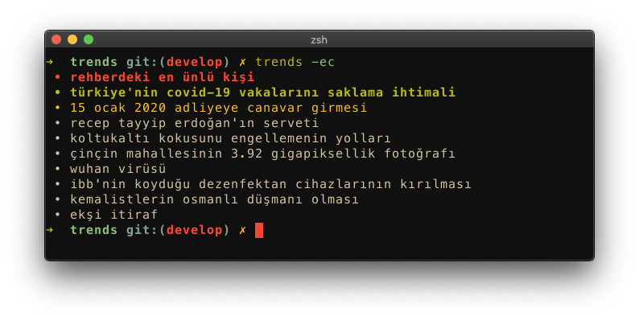
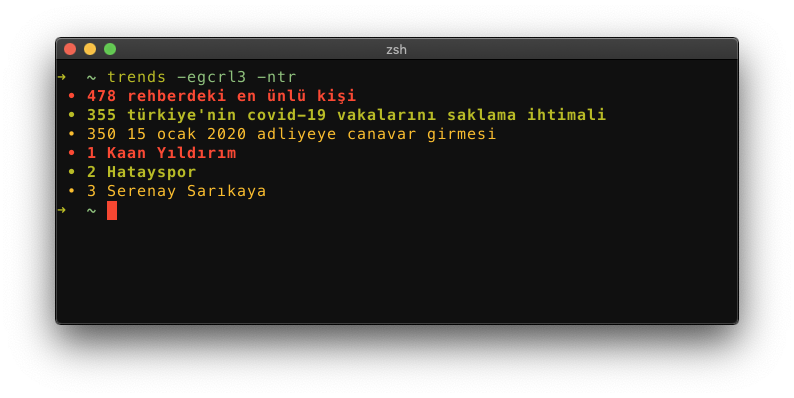

# Trends

Trends shows trends of a country from [google daily
trends](https://trends.google.com/trends/?geo=GB) or sorted left "gundem" frame
from [eksisozluk](https://eksisozluk.com).

## Requirements

- [cURL](https://github.com/curl/curl) - A command line tool and library for transferring data with URL syntax.
- [pup](https://github.com/ericchiang/pup) - Parsing HTML at the command line.

## Installation

```sh
cd trends
mkdir -p /usr/local/bin
install ./trends /usr/local/bin
```

## Usage

```sh
trends [ -egrc ] [ -l limit ] [ -n countrycode ]
```

> Note `< required >` `[ optional ]`

### Options
- `-e`		**eksisozluk (is the default option if no args given).**
- `-g`		**show google daily trends.**
- `-r`		**enable rates.**
- `-c`		**format and color the top 3 trends.**
- `-n CC`	**specify the nation (gb, us, il etc.) (default: gb).**
- `-l NR`	**limit (default: 10)**

## Examples
### Basic Usage

Show eksisozluk gundem.

```sh
$ trends
```
```txt
rehberdeki en ünlü kişi 
türkiye'nin covid-19 vakalarını saklama ihtimali 
15 ocak 2020 adliyeye canavar girmesi 
recep tayyip erdoğan'ın serveti 
koltukaltı kokusunu engellemenin yolları 
çinçin mahallesinin 3.92 gigapiksellik fotoğrafı 
wuhan virüsü 
ibb'nin koyduğu dezenfektan cihazlarının kırılması 
kemalistlerin osmanlı düşmanı olması 
ekşi itiraf 
```
 
Show google trends for default nation (Great Britain).

```sh
$ trends -g
```
```txt
Liverpool vs Bournemouth
Yoel Romero
Amber Rudd
Tony Ferguson
SXSW
Rugby
Six Nations
Post Malone
Spenser Confidential
Nottingham Forest
```

### Limiting

For eksisozluk
```sh
$ trends -el3
```
```txt
rehberdeki en ünlü kişi 
türkiye'nin covid-19 vakalarını saklama ihtimali 
15 ocak 2020 adliyeye canavar girmesi 
```
 
For google
```sh
$ trends -n il -l 3
```
```txt
Spenser Confidential
רצח בהוד השרון
אוזני המן מתכון
```

### Coloring (using tput)
```sh
$ trends -ec
```


### Enable Rates
```sh
$ trends -er
```
```txt
478 rehberdeki en ünlü kişi 
354 türkiye'nin covid-19 vakalarını saklama ihtimali 
350 15 ocak 2020 adliyeye canavar girmesi 
346 recep tayyip erdoğan'ın serveti 
280 koltukaltı kokusunu engellemenin yolları 
279 çinçin mahallesinin 3.92 gigapiksellik fotoğrafı 
270 wuhan virüsü 
259 ibb'nin koyduğu dezenfektan cihazlarının kırılması 
253 kemalistlerin osmanlı düşmanı olması 
158 ekşi itiraf 
```
```sh
$ trends -gr
```
```txt
1 Liverpool vs Bournemouth
2 Yoel Romero
3 Amber Rudd
4 Tony Ferguson
5 SXSW
6 Rugby
7 Six Nations
8 Post Malone
9 Spenser Confidential
10 Nottingham Forest
```

### Show Both Platforms with Limit 3, Rates and Color for Turkey
```sh
$ trends -egcrl3 -ntr
```


> Note: No need to specify -g if the -n option used. Because nation option is
> only available for google trends, not others. So it is automatically triggers
> google option.
